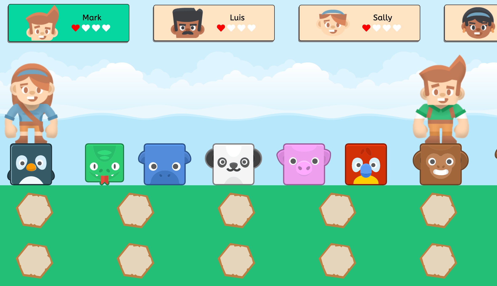
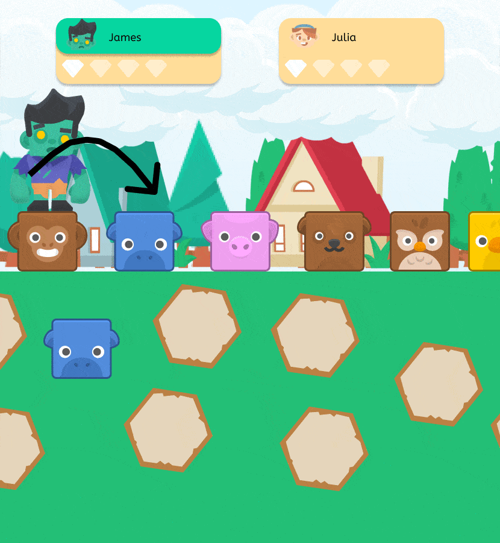
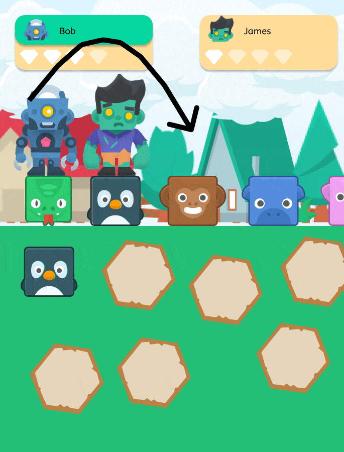
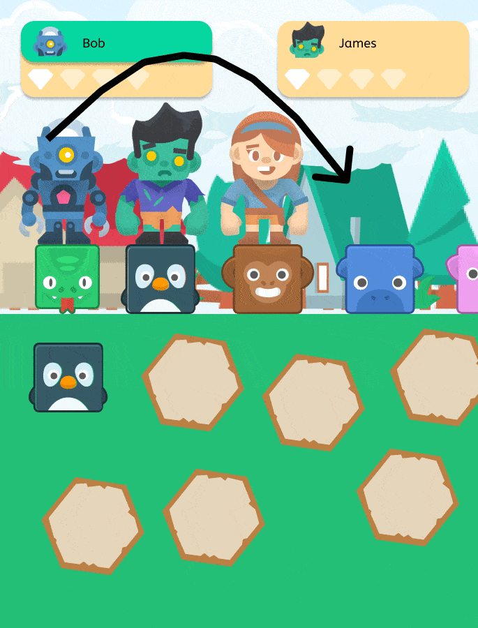

# Creature Clash
Go wild in this animal-themed memory matching game!

## Play it Now

You can play the game right in your browser on its [itch.io page](https://ubercj.itch.io/creature-clash).

## Table of Contents

* [About the Project](#about-the-project)
* [How to Play](#how-to-play)
* [Tools Used](#tools-used)
* [Credits](#credits)
* [License](#license)

## About the Project

This game is an entry for the [2021 Game Jam](https://itch.io/jam/top-jam-1) organized by the community at [The Odin Project](https://www.theodinproject.com/). The theme for the Game Jam was "Edutainment" - a combination of education and entertainment.

We had a lot of ideas for our game, but we eventually settled on Creature Clash, a memory matching card game heavily inspired by the existing board game [Chicken Cha Cha Cha](https://boardgamegeek.com/boardgame/3570/chicken-cha-cha-cha).

Creating this game was challenging in a lot of ways - our development team consisted of 3 complete strangers, each living in a different country and with varying levels of skills and experience. For some of us, it was the first time collaborating on a project rather than going solo. We all worked in our spare time, juggling this project with studying, day jobs and job searches. Add to this that we communicated solely in English and only one of us is a native speaker, so it took a little while for us to all get on the same page and establish a good work flow.

Despite all of this... making this game was a blast! We all learned so much from each other, and built friendships that will last well after we submit the final version of our game.

## How To Play

The goal of Creature Clash is to move your character past every single other player's character, stealing a heart from each one as you go by them. The first player to collect all of the hearts wins.

The game is played in turns, with players attempting to move their characters down the pathway. On a player's turn, they look at the image on the next tile in front of their character. The player then flips over one of the face-down tiles. If the tile that was flipped over shows the same image as the next tile in front of the character, the player moves forward one space on to that tile, and then repeats the process with the next tile. When the player flips character goes no further.

If the next tile in front of a player is occupied by someone else's character, and the player succeeds in matching that tile, their character "leapfrogs" over the character in front of them to land on the next tile in front of that player, and in the process steals all hearts that the other player had - including those it stole from other players in the same manner. When one player has all of the hearts, that player wins the game.

## Tools Used

* The visual assets used in our project came from [Kenney](https://www.kenney.nl/).
  * [Backgrounds](https://www.kenney.nl/assets/background-elements-redux)
  * [Animals](https://www.kenney.nl/assets/animal-pack-redux)
  * [Characters](https://www.kenney.nl/assets/toon-characters-1)

* [PubSubJS](https://github.com/mroderick/PubSubJS) npm package for publish/subscribe patterns

* [Sass](https://sass-lang.com/) for CSS pre-processing

* [Webpack](https://webpack.js.org/) for bundling modules and dependencies, and the following loaders were used to manage assets:
  * [html-webpack-plugin](https://webpack.js.org/plugins/html-webpack-plugin/) and [html-loader](https://webpack.js.org/loaders/html-loader/)
  * [style-loader](https://webpack.js.org/loaders/style-loader/), [css-loader](https://webpack.js.org/loaders/css-loader/), and [sass-loader](https://webpack.js.org/loaders/sass-loader/)

## Credits

Creature Clash was developed by [Chris Jones](https://github.com/ubercj), [Adrián Moncada](https://github.com/Adrian-ignaciomoncada), and [Gabriel Sena](https://github.com/gabesenacom).

Shout out to [Chicken Cha Cha Cha](https://boardgamegeek.com/boardgame/3570/chicken-cha-cha-cha) for inspring this game.

And of course, thank you to [The Odin Project](https://www.theodinproject.com/) and the community on Discord for organizing this Game Jam and for helping us develop the knowledge and skills we used to make this game!

## License

Creature Clash is released under the [ISC License](./LICENSE.md). Please contact one of us if you would like to use any part of our game for any reason.